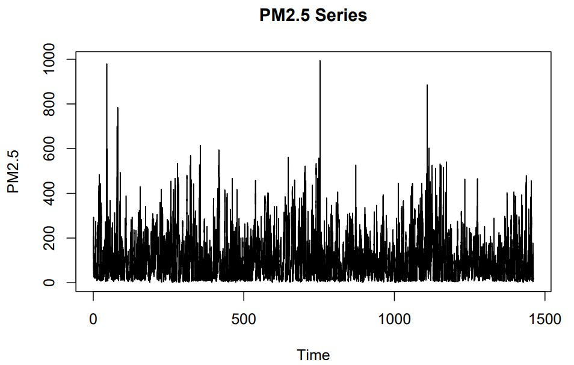
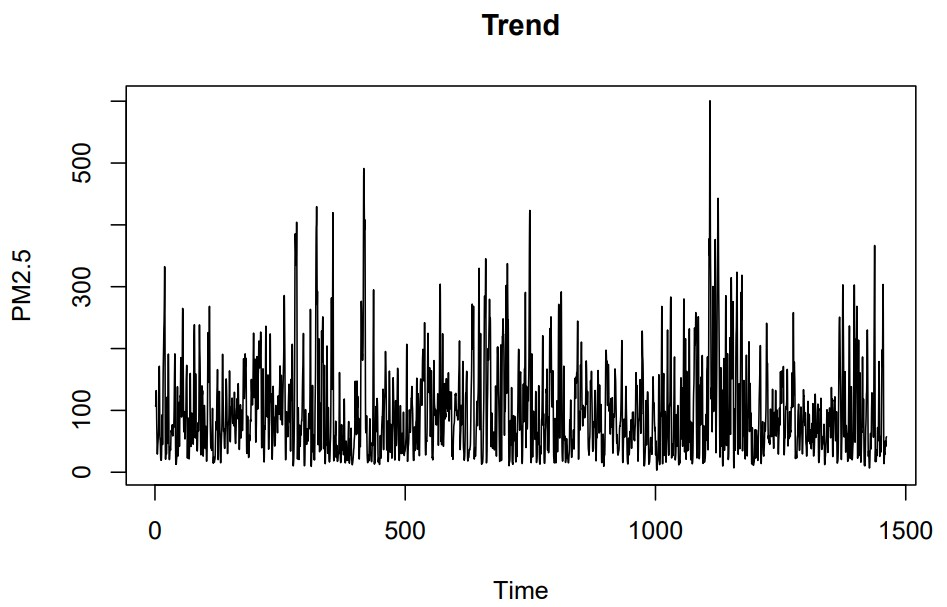
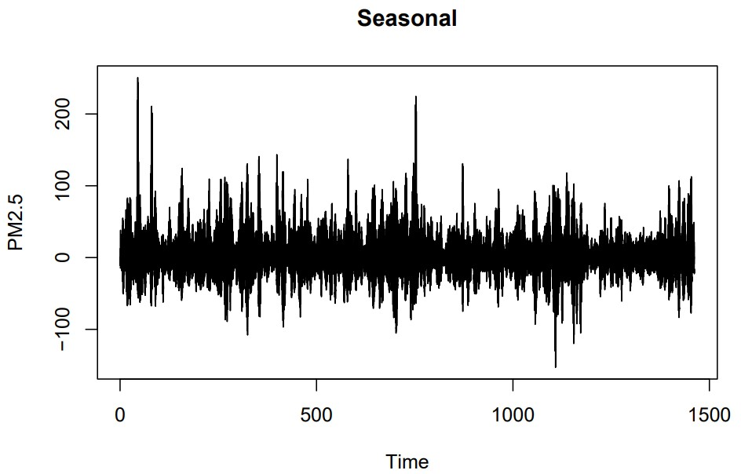
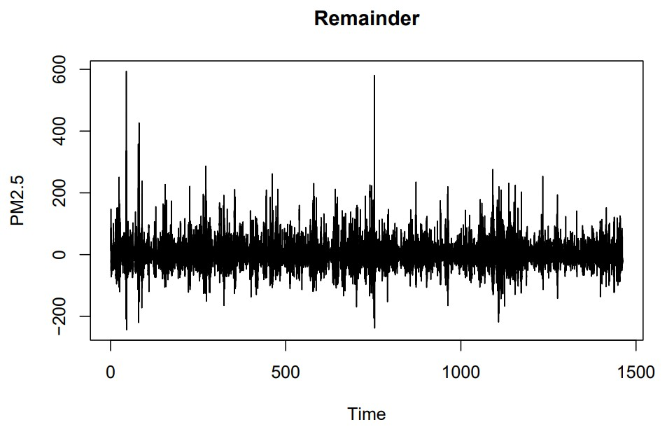
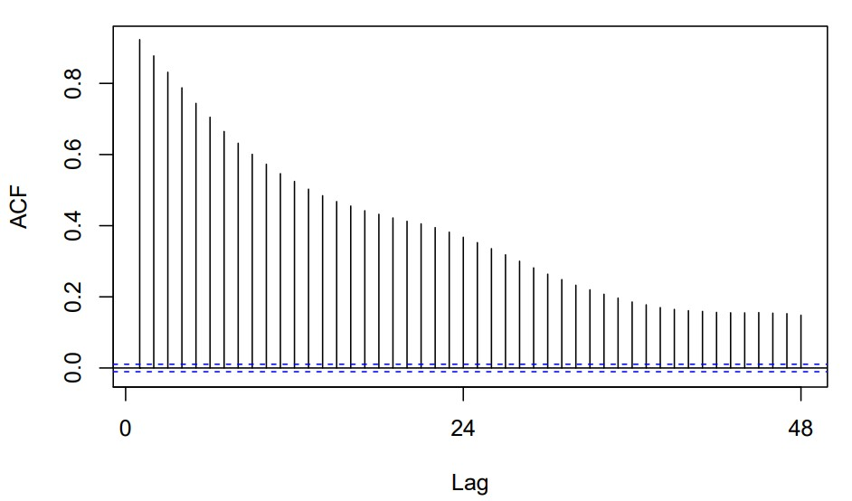
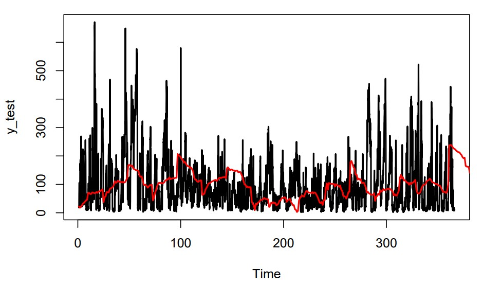

# Beijing PM2.5 Time-series Forecasting with an ARIMAX Model

## Overview

This project implements an AutoRegressive Integrated Moving Average with Exogenous Variables (ARIMAX) model to forecast PM2.5 concentration in Beijing over time. PM2.5 refers to particulate matter with a diameter of 2.5 micrometers or smaller, a major air pollutant that poses significant health risks. The model combines past PM2.5 observations with external meteorological variables to improve forecasting performance. The code was developed and executed using RStudio.

## Data

This project uses the Beijing PM2.5 dataset, which is an air quality time-series dataset collected in Beijing between 2010 and 2014. The dataset contains 43824 hourly observations across 12 variables, including PM2.5 concentration and related weather variables. The dataset is publicly available at: <https://archive.ics.uci.edu/dataset/381/beijing+pm2+5+data>

The outcome variable of interest is *pm25*, representing the PM2.5 concentration. The remaining variables, excluding the date and time variables (*year, month, day,* and *hour*), were treated as external predictors in the ARIMAX model.

Exploratory data analysis indicates that PM2.5 concentration (*pm25*) and cumulative wind speed (*iws*) are positively skewed due to occasional extreme values, while atmospheric pressure (*pres*) remains relatively stable. Temperature (*temp*) and dew point (*dewp*) exhibit considerable variation without strong skewness. The combined wind direction (*cbwd*) is dominated by southeast and northwest winds. Cumulated hours of snow (*is*) and rain (*ir*) are heavily concentrated at zero, indicating that snowfall and rainfall events are rare during the observation period.

Moreover, the negative correlation between PM2.5 concentration (*pm25*) and cumulative wind speed (*iws*) suggests that higher wind speeds may contribute to the dispersion of air pollutants.

The dataset was divided chronologically into training and test sets following an 80:20 ratio. Multiple missing values were found in the pm25 variable, which were imputed using Multiple Imputation by Chained Equations (MICE) with Predictive Mean Matching (PMM). Numeric external predictor variables were standardized using the mean and standard deviation computed from the training set.

Following preprocessing, the training PM2.5 series exhibited high volatility, with a standard deviation (91.42) nearly as large as its mean (98.78).

## Methods

Variance Inflation Factor (VIF) analysis of the numeric external predictors indicated moderate multicollinearity among *dewp, temp,* and *pres*, which is expected because these variables are meteorologically related. However, since all VIF values remained below 5, all numeric external predictors were retained in the ARIMAX model.

The training and test PM2.5 concentration data were converted into time series objects with a seasonal frequency of 24 to capture the daily pattern in the hourly observations.

***Figure 1:** The original training PM2.5 series*

The original training PM2.5 series plot shows that PM2.5 concentration fluctuates substantially over time, with several sharp spikes indicating periods of exceptionally high air pollution. Although no clear upward or downward trend is observed, periods of elevated PM2.5 concentrations appear repeatedly across different years, suggesting possible seasonal or cyclical patterns. Furthermore, the mean and variance of the series don’t appear constant over time, which indicates that the series may be non-stationary.

***Figure 2:** The original training PM2.5 series decomposition*

Time-series decomposition showed no clear upward or downward trend in the trend component or any obvious daily seasonal pattern in the seasonal component. Moreover, the remainder (residual) component was centered around zero with no visible pattern, somewhat resembling white noise and suggesting that the trend and seasonal components captured most of the underlying data structure.

However, the remainder component still displays non-constant variance and several large spikes, which may indicate the presence of outliers or short-term events not explained by the trend and seasonal components.

***Figure 3:** ACF of the original training PM2.5 series*

Although the p-value of the Augmented Dickey-Fuller (ADF) test was smaller than 0.01, indicating stationarity, the ACF values decayed slowly toward zero, suggesting non-stationarity. Therefore, first-order differencing was applied to the PM2.5 series.

First-order differencing produced a more stationary PM2.5 series with a nearly constant mean of 0, making it more suitable for ARIMAX modeling, although occasional large fluctuations remained. After differencing, the ADF test again indicated stationarity. In addition, the ACF values dropped close to 0 after only the first 2 lags, further supporting stationarity.

Although the differenced series appeared stationary with a nearly constant mean of 0, not all ACF autocorrelations were insignificant, suggesting that the series wasn't white noise. Therefore, first-order differencing (d = 1) was used for modeling. In addition, the PACF and ACF suggested that the AR and MA orders are p = 1 and q = 2, respectively.

The *cwd* factor variable was converted into dummy variables for use as external predictors. Then, an ARIMAX(p=1, d=1, q=2) model (without seasonal terms) was fitted to the training set, using *pm25* as the response variable and meteorological variables (*dewp, temp, pres, cbwd, iws, is,* and *ir*) as external predictors.

Residual diagnostics showed that the residuals were centered around 0 and that most autocorrelation was removed. Although the Ljung-Box test indicated some remaining autocorrelation, its magnitude was generally small based on the ACF analysis. Overall, the diagnostics suggested that the ARIMAX model captured the major structure of the PM2.5 series, with only weak residual dependence remaining.

Forecasting performance was evaluated using *24-step forecasting*, where the model's internal state was updated every 24 hours. Root Mean Squared Error (RMSE), Mean Absolute Error (MAE), and Mean Absolute Scaled Error (MASE) were used as evaluation metrics. Multi-step forecasting results were additionally reported for comparison.

## Results

> Suppose ARIMAX forecasting starts after time T. In **multi-step forecasting**, the model is fitted once using the observed values up to time point T and is not updated thereafter. Multi-step forecasting uses the real observations up to time T, as well as the predicted values of time points T+1, … T+k, in order to forecast the observation of time point T+k+1. In contrast, **one-step forecasting** only uses the real observations up to time point T+k in order to forecast the observation of time point T+k+1, with the model being updated after each newly observed value becomes available. Since real observations can only be revealed one by one in time, one-step forecasting is more time consuming, but tends to be more accurate.
>
> As a compromise between these two approaches, **h-step forecasting** (h\>1) uses all real observations up to time T to forecast the observations at time points T+1, …, T+h. Once the actual observations for these h time periods become available, the model is updated and used to forecast the next h observations. Therefore, h-step forecasting generally produces more accurate forecasts than multi-step forecasting while requiring less computational effort than one-step forecasting.
>
> During one-step (or h-step) forecasting for ARIMAX, it’s possible to refit the model at every step (or every h steps) or just update the internal state (Kalman filter) instead to reduce runtime.

Model performance was first evaluated using multi-step forecasting, which yielded a test RMSE of 121.32 and a test MAE of 102.65. However, because forecasting errors tend to accumulate over longer forecasting horizons, additional evaluation using a 24-step forecasting strategy, in which only the model's internal state was updated every 24 steps, was conducted to assess whether more frequent model updates can improve predictive performance.

For the h-step forecasting strategy, h = 24 was selected since updating the model every few hours (by choosing a shorter forecasting horizon such as h = 1, 6, or 12) is unrealistic in practice. When the forecasting horizon is too short, the forecasting task becomes less meaningful and more closely resembles a tracking task.

Under the 24-step forecasting strategy, the ARIMAX(1,1,2) model achieved a *training RMSE of 65.55 and MAE of 44.80*, while the corresponding *test RMSE and MAE were 60.22 and 41.88*, respectively. There was only a small difference between the error measures on the training and test sets, indicating good generalization performance with no evidence of overfitting. Interestingly, the model achieved slightly better performance on the test set than on the training set, likely due to differences in the data characteristics of the two time periods.

The test MAE value (41.88) was about 42.4% of the mean PM2.5 concentration in the training data (98.78), while the test RMSE value (60.22) was about 65.9% of the training standard deviation (91.42). This suggested that although the model captured a substantial portion of the overall variability, it still left a large fraction of short-term fluctuations unexplained. However, these results were substantially better than those obtained under the multi-step forecasting setup (test RMSE = 121.32 and MAE = 102.65).

***Figure 4:** Forecasted-vs-actual PM2.5 values on test set*

According to the forecasted-vs-actual PM2.5 plot for the test set, the forecasts (red line) captured the overall movement of the series but failed to follow most short-term spikes. Overall, this suggested that the model was suitable for capturing broad patterns in the data but less effective at predicting short-term volatility and extreme events.

Next, model performance was compared with a naive forecasting benchmark on the test set across forecasting horizons of 1, 6, 12, and 24. The MASE results showed a clear dependence on the forecasting horizon: 3.326 (h = 1), 1.067 (h = 6), 0.771 (h = 12), and 0.618 (h = 24). At shorter forecasting horizons, the model performed worse than the naive benchmark, with MASE values above 1 for horizons 1 and 6. This indicated that the model was less effective at capturing short-term dynamics than the naive forecasting model. However, performance improved as the forecasting horizon increased. At horizons 12 and 24, the MASE values fell below 1, indicating that the model outperformed the naive benchmark for longer-term forecasting.

Overall, the results indicated that under the 24-step forecasting strategy, the model was less effective than the naive forecasting benchmark at short forecasting horizons but became increasingly competitive as the forecasting horizon increased. This is not surprising, as naive forecasting models are typically very strong at short forecasting horizons.

In summary, the ARIMAX(1,1,2) model is suitable for forecasting PM2.5 concentrations when external meteorological information is available, using a 24-step forecasting strategy that updates only the model's internal state every 24 steps, although forecasting performance remains limited by the highly volatile nature of air pollution data.
